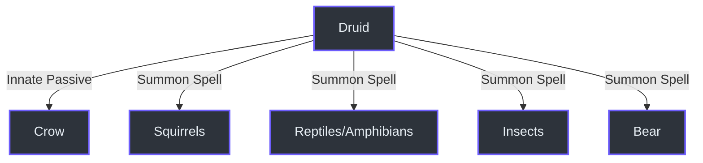
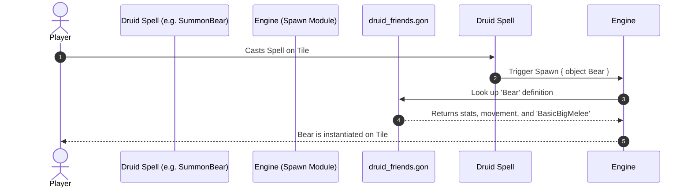

# Druid Class Reference

The Druid class in Mewgenics is defined in `data/classes/advanced_classes.gon` (line 415) under the identifier `Druid`. The Druid specializes in two core mechanics: **Shapeshifting Transformations** and **Familiar Summoning**. 

This document exhaustively details the mechanical properties of all 8 Druid forms and the exact abilities possessed by their familiar summons.

---

## 1. Shapeshifting Transformations

Transformations are `self_buff` cantrips that alter the Druid's stats, replace their basic attack, and transform the casting spell into a new, specialized ability. 

Every single form and their exact `CatPartsTransform` linkages (used to call exact frames/sprites inside `catparts.swf`) are exhaustively documented below.

### Tiger Form (Form of the Wolf)
*Internal Name: `TigerForm` / `TigerForm2` (`data/abilities/druid_abilities.gon`:1168)*

- **Effect**: Gains +2 Speed, +2 Strength, -2 Luck, -2 Intelligence.
- **Level 2 Effect**: Removes the Luck and Intelligence penalties.
- **CatPartsTransform**: `tail 4`, `body 31`, `head 12`, `arm1 1013`, `arm2 1013`, `leg1 41`, `leg2 41`, `ear1 23`, `ear2 23`
- **Basic Attack**: Becomes `TigerSwipes` (`TigerSwipes2` at Lv 2). *A melee attack that deals high physical damage.*
- **New Ability**: Becomes **Pounce** (`Pounce2` at Lv 2). 
  - *Desc:* Jump on a unit, damaging and displacing it.
  - *Level 2:* Also inflicts Bleed 1 to the target.

### Rhino Form (Form of the Turtle)
*Internal Name: `RhinoForm` / `RhinoForm2` (`data/abilities/druid_abilities.gon`:1272)*

- **Effect**: Gains +2 Constitution, applies 10 Shield, -2 Intelligence, -2 Speed.
- **Level 2 Effect**: Removes the Speed penalty.
- **CatPartsTransform**: `tail 1503`, `body 1029`, `mouth 1005`
- **Basic Attack**: Becomes **Head Bash**.
  - *Desc:* Dash forward one tile, then attack. This attack deals Knockback and has a chance to inflict Stun.
- **New Ability**: Becomes **Harden Shell** (`HardenSkin2` at Lv 2).
  - *Desc:* Gain +1 [img:shield], +1 Thorns, and +1 temporary Brace.
  - *Level 2:* The spell costs less mana.

### Monkey Form
*Internal Name: `MonkeyForm` / `MonkeyForm2` (`data/abilities/druid_abilities.gon`:1340)*

- **Effect**: Gains +2 Dexterity, +2 Luck, -2 Constitution, -2 Charisma.
- **Level 2 Effect**: Removes the Constitution and Charisma penalties.
- **CatPartsTransform**: `tail 1502`, `ear1 1501`, `ear2 1501`, `mouth 1501`, `arm1 1501`, `arm2 1501`, `leg1 1501`, `leg2 1501`
- **Basic Attack**: Becomes **Throw Poop**.
  - *Desc:* Throw poop. (A low-damage ranged attack that inflicts status).
- **New Ability**: Becomes **Monkey Toss** (`MonkeyToss2` at Lv 2).
  - *Desc:* Throw an adjacent unit to another tile. It takes damage if it's thrown onto something.
  - *Level 2:* The spell costs less mana.

### Raccoon Form
*Internal Name: `RaccoonForm` / `RaccoonForm2` (`data/abilities/druid_abilities.gon`:1400)*

- **Effect**: Gains +2 Intelligence, -2 Strength.
- **Level 2 Effect**: Removes the Strength penalty and adds +2 Luck.
- **CatPartsTransform**: `tail 1504`, `head 1504`, `texture 1008`
- **Basic Attack**: Becomes **Pilfer**.
  - *Desc:* A melee attack that scatters two random pickups when it hits.
- **New Ability**: Becomes **Scavenge** (`Scavenge2` at Lv 2).
  - *Desc:* Run to any pickup and collect it.
  - *Level 2:* The effects of that collected pickup are doubled.

### Tree Form
*Internal Name: `TreeForm` (`data/abilities/druid_abilities.gon`:1442)*

- **Effect**: Gains -2 Intelligence, +5 Shield, and Brace 2. You become immobile and immune to Knockback. Adds the `plant` tag and element immunity to `Creep`.
- **CatPartsTransform**: `texture 322`, `ear1 325`, `arm2 324`
- **Basic Attack**: Becomes **Timber**.
  - *Desc:* Fall into an adjacent tile, dealing massive damage to units you displace.
- **New Ability**: Becomes **Synthesize**.
  - *Desc:* Heal 2 HP and gain Charge 2.
  - *Level 2:* You and allies within 3 tiles gain 2 HP and 2 Charge.

### Squirrel Form
*Internal Name: `SquirrelForm` (`data/abilities/druid_abilities.gon`:1492)*

- **Effect**: Spawn squirrels on each adjacent tile, then enter Squirrel Form. Adds the `squirrel` tag.
- **CatPartsTransform**: `mouth 1071`, `tail 1042`, `ear1 1036`, `ear2 1036`
- **Basic Attack**: Becomes **Chitter**.
  - *Desc:* Each squirrel gains +2 Damage and +2 [img:spd].
- **New Ability**: Becomes **Birth Squirrel**.
  - *Desc:* Summon a squirrel. (Castable once per turn.)

### Elk Form
*Internal Name: `ElkForm` / `ElkForm2` (`data/abilities/druid_abilities.gon`:1532)*

- **Effect**: Gains +8 Speed, -2 Intelligence, -2 Constitution, and Trample 3. You ignore tile effects while moving and gain an aerial YOffset of .25.
- **Level 2 Effect**: Removes the Int/Con penalties.
- **CatPartsTransform**: `leg1 338`, `leg2 338`, `arm1 338`, `arm2 338`, `ear1 343`, `ear2 343`
- **Basic Attack**: Becomes **Antler Swipe**.
  - *Desc:* Toss a unit up to four tiles away. Inflict Bruise on it and any unit it lands on. (Level 2 also deals raw damage).
- **New Ability**: Becomes **Prance**.
  - *Desc:* Refresh your movement action.

### Mockingbird Form
*Internal Name: `MockingbirdForm` / `MockingbirdForm2` (`data/abilities/druid_abilities.gon`:1584)*

- **Effect**: Gains flying movement (`Flying 1`), +2 Luck, and -2 Strength.
- **Level 2 Effect**: Removes the Strength penalty.
- **CatPartsTransform**: `tail 337`, `mouth 320`, `arm1 339`, `arm2 339`, `ear1 1005`, `ear2 1005`
- **Basic Attack**: Becomes **Mock Song**.
  - *Desc:* Give each unit within an area All Stats Down 2 until the end of their next turn.
  - *Level 2:* Only affects enemies, and gives allies All Stats Up 2.
- **New Ability**: Becomes **Tease**.
  - *Desc:* Inflict Madness 1 on a unit.
  - *Level 2:* The unit immediately attacks a unit if it can.

---

## 2. Familiar Summons

Druids can summon various animal friends. The properties and AI behaviors of these familiars are defined in `data/characters/druid_friends.gon`. All standard familiars inherit the `can_get_bonus true` tag, allowing them to benefit from class-specific passives (like the Druid Set Bonus defined in `data/text/combined.csv`:31631).

### The Crow Companion
*Source: `data/characters/druid_friends.gon`:1*

The Druid has an innate passive, `SpawnOnBattleStart Crow`, meaning the Crow is always present.
- **Movement**: `DefaultMove`
- **Attack**: `BasicMelee` (Standard 1-range bite/peck).
- **Spells**: 
  - **Flutter**: Fly over 3 tiles (up to 5 tiles at max level).
  - **Flap**: Standard wing attack.
- **Unique Passives**: 
  - `InheritSpawnerStats 1` (Copies Druid's stats)
  - `CrowAttackLink 1` (Attacks automatically when the Druid attacks)

### Rodents & Mammals

| Familiar | Base Attack | Movement | Spells / Passives | Source |
| :--- | :--- | :--- | :--- | :--- |
| **Baby Squirrel** | `BasicMelee` | `DefaultMove` | None | `druid_friends.gon`:40 |
| **Squirrel** | **Squirrel Swipes**: *A melee attack that hits 1-3 times.* | `DefaultMove` | None | `druid_friends.gon`:58 |
| **Bear** | `BasicBigMelee` (Heavy damage 1-range attack) | `DefaultMove` | **Passive**: `Trample 3`, Applies `Bleed 1` on hit | `druid_friends.gon`:210 |

### Reptiles & Amphibians

| Familiar | Base Attack | Movement | Spells / Passives | Source |
| :--- | :--- | :--- | :--- | :--- |
| **Snake** | `BasicMelee` | `DefaultMove` | **Passive**: Applies `Poison 1` on hit | `druid_friends.gon`:95 |
| **Turtle** | `BasicTankMelee` (High defensive knockback attack) | `DefaultMove` | None | `druid_friends.gon`:134 |
| **Toad** | `BasicHook` (Pulls enemies closer) | `BasicJump` | None | `druid_friends.gon`:153 |

### Insects

| Familiar | Base Attack | Movement | Spells / Passives | Source |
| :--- | :--- | :--- | :--- | :--- |
| **Caterpillar** | `BasicMelee` | `DefaultMove` | **Passive**: End of turn `AllStatsUp 1`, `HealthGain 4` | `druid_friends.gon`:256 |
| **Moth** | `BasicShortLobbed` (Short-range lobbed shot) | `DefaultMove` | **Spells**: `Flutter`, **Sleep Powder** (*Inflicts Sleep on a unit*). | `druid_friends.gon`:297 |

---

## 3. Implementation Data Flow

The exact code path for summoning familiars runs through the game's `Spawn` effect, linked via `SpawnOnBattleStart` passives or direct abilities.

## References
1. **Class Architecture**: `data/classes/advanced_classes.gon` (Druid innate passives and ability pool)
2. **Familiar Stats**: `data/characters/druid_friends.gon` (All familiar base stats and ability links)
3. **Transformation Abilities**: `data/abilities/druid_abilities.gon` (TigerForm, RhinoForm, MonkeyForm, RaccoonForm logic)
4. **Localization & Names**: `data/text/combined.csv` (Translation mapping, e.g. `ABILITY_FORMOFTHEWOLF_NAME`)
5. **General Engine Rules**: `data/keyword_tooltips.gon` (Used to determine what statuses like Bleed and Poison do)
